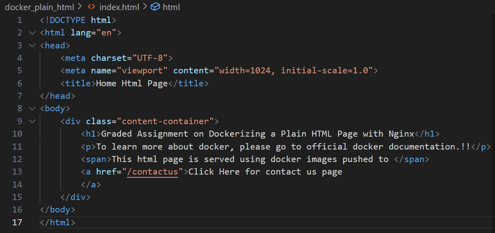
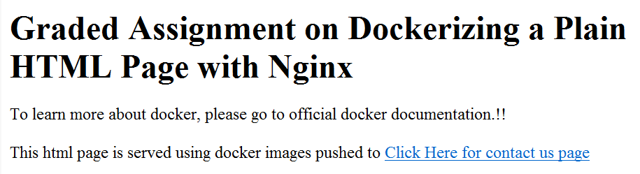
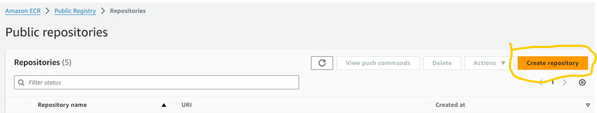
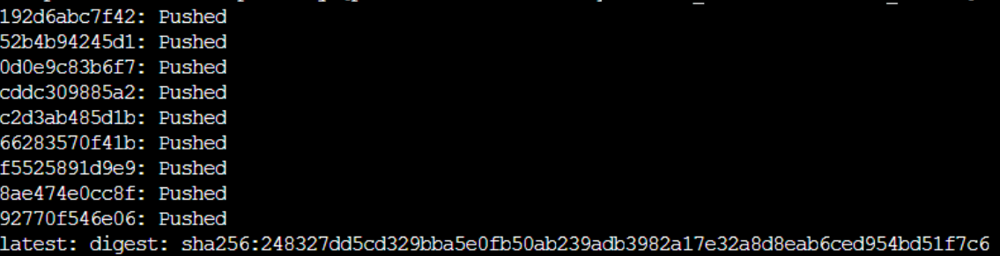

# docker-plain-html

* Step 1: Install Docker 
    - sudo apt install docker.io -y
* Step 2: Create your plain html application
    - In our case it is .\index.html containing some html code
    
* Step 3:
    - Create a docker file name s ad `Dockerfile`
    - Paste the below code
        - FROM nginx
        - WORKDIR /plainNginx
        - COPY . /plainNginx
        - COPY . /usr/share/nginx/html
        - EXPOSE 80 `
* Step 4: Build | Test | Push To ECR
    - docker build -t plain_html:latest .
    - docker run -it -d  -p 8080:80 plain_html:latest
    
    - If things are working then proceed to push the docker image into your public ECR repository
    - Use `aws configure` command to connect your aws cli
        - `AWS Access Key ID:
        AWS secret Acess Key:
        Default region name: ap-south-1
        Default output format:`
    - Create a public repository
    
    - Use command to tag your local docker image to ECR.
        - `docker tag plain_html:latest public.ecr.aws/c3w1m1q2/plain_html:latest`
    - Use command to push the docker image
        - `docker push public.ecr.aws/c3w1m1q2/plain_html:latest`
        
    - Image repository
        https://gallery.ecr.aws/c3w1m1q2/plain_html